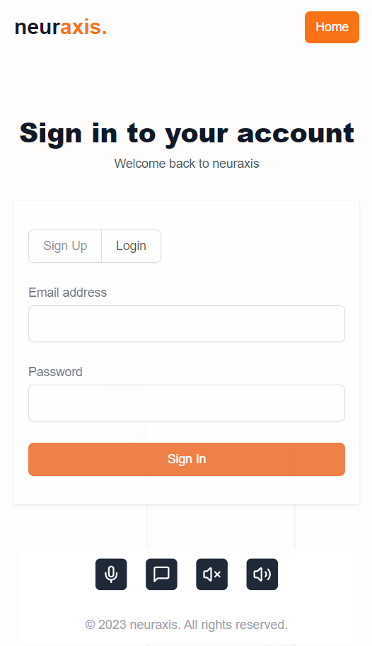

# neuraxis: Real-Time ISL for a World Without Barriers

Below is the figma design of our website which hosts all features of the application:

  
  

## Welcome to neuraxis!

Hey there! 👋 I'm excited to introduce you to neuraxis, my passion project aimed at breaking down communication barriers through real-time Indian Sign Language (ISL) translation. As someone deeply invested in both web development and machine learning, I've poured my heart and soul into creating a platform that seamlessly bridges the gap between spoken language and ISL.

## What's neuraxis all about?

neuraxis is more than just an app – it's a gateway to inclusive communication. Here's what it does:

1. **Speech to Sign Conversion**: Speak into your device, and watch as neuraxis translates it into ISL in real-time.
2. **Text to Sign Conversion**: Type your message, and see it transformed into ISL gestures.
3. **Sign to Speech Conversion**: Use your camera to sign, and neuraxis will convert it to spoken words.
4. **Sign to Text Conversion**: Sign away, and neuraxis will transcribe it into text.

## The Tech Behind the Magic

### Web Development
I've built the frontend using cutting-edge web technologies to ensure a smooth, responsive user experience:

- **React**: For building a dynamic, efficient user interface.
- **Next.js**: Leveraging server-side rendering for lightning-fast page loads.
- **Tailwind CSS**: For crafting a sleek, modern design without the hassle of writing custom CSS.

### Machine Learning
The real magic happens behind the scenes with some powerful ML models:

- **Natural Language Processing (NLP)**: I use advanced NLP techniques to tokenize and understand text input.
- **Computer Vision**: OpenCV and MediaPipe are the backbone of our sign language recognition system.
- **Random Forest Classifier**: This helps in accurately classifying different hand gestures.
- **Large Language Model (LLM)**: For generating natural language from classified signs.

## Getting Started

Want to give neuraxis a spin? Here's how:

1. Clone this repository
2. Install dependencies with `npm install`
3. Run the development server with `npm start`
4. Open `http://localhost:3000` in your browser

## Join the Journey

neuraxis is more than just a project – it's a mission to make communication accessible to everyone. Whether you're a developer, a sign language enthusiast, or someone passionate about accessibility, I'd love for you to be part of this journey.

Feel free to open issues, submit pull requests, or reach out with ideas. Let's build a world without communication barriers, one sign at a time!

Happy coding, and happy signing! 🖐️✨
